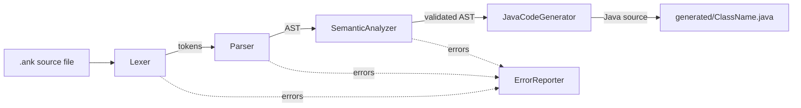
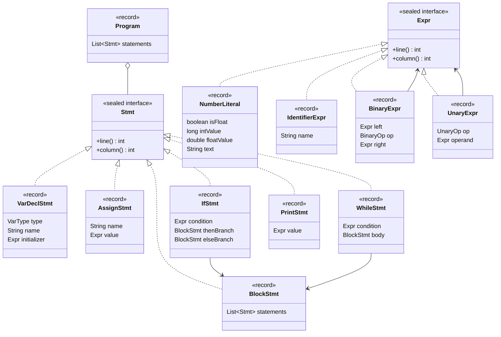
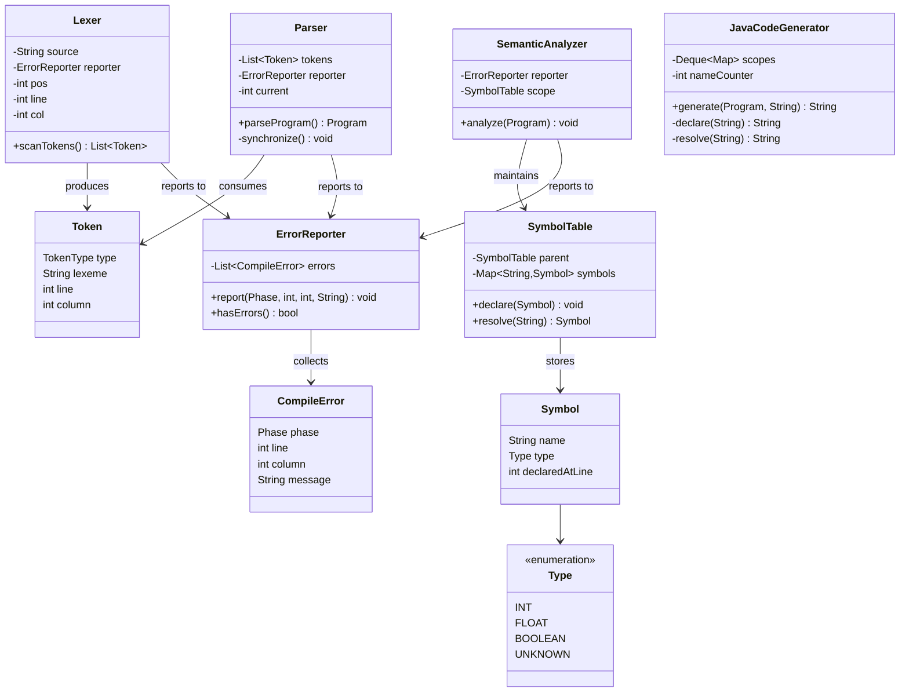

# CSE-4114 Final Report: অঙ্কুর (Ankur)

**Course:** CSE-4114 — Compiler Design and Construction Sessional
**Project:** A compiler for an originally-invented Bangla programming language
**Team:** *(fill in from [`Team.txt`](../Team.txt))*

This report covers the three required sections: the Pitch, the Compiler
Design, and the Language Grammar.

---

## 1. The Pitch

### Real-World Relevance

Bangla is the first language of roughly 170–230 million people, the vast
majority of them in Bangladesh. Programming education is increasingly
starting earlier — school-level coding curricula, coding clubs, and
self-taught learners working from phones and low-end laptops — but nearly
every language a beginner meets (Python, Java, C, JavaScript) uses English
keywords. For a student who isn't yet comfortable in English, that's a
**second barrier stacked on top of the first**: they have to learn an
unfamiliar vocabulary *and* an unfamiliar way of thinking, at the same time,
before they can write a single working program. Ankur exists to separate
those two problems, so the first thing a new programmer struggles with is
the actual *logic* — not what `while` means in a language they don't speak
yet.

### Problem-Solving: what gap Ankur fills

Existing options for a Bangla-speaking beginner sit at two extremes:

- **Block-based tools** (Scratch and similar) remove the language barrier
  entirely, but also remove real syntax — students never write an
  expression, never see a type, never hit a semicolon. It doesn't build the
  muscle memory that transfers to a real language later.
- **Mainstream text languages** teach real syntax, but reintroduce the
  English-vocabulary barrier this project is trying to remove.

Ankur sits in the middle: **real, typed, text-based syntax** — variables,
arithmetic with correct precedence, conditionals, loops — expressed
entirely in Bangla script, down to the identifiers a student names
themselves. Every design choice in the language reinforces this: one block
rule (`শুরু ... শেষ`) for the program, `if`, and `while` alike, instead of
mixing Bangla keywords with `{ }` braces; digits accepted in Bangla-Indic
*or* Arabic-numeral form, so numeral familiarity is never a blocker; and
compiler error messages that name the Bangla keyword directly (e.g. *"The
condition of 'যদি' must be a boolean expression"*), so debugging doesn't
require a mental translation step either.

### Long-Term Vision

As submitted for this course, Ankur is a toy front end plus a Java
transpiler. The long-term vision is a genuinely usable **first-language
teaching tool** for secondary schools: an editor with Bangla keyword
autocomplete, inline Bangla error messages (the compiler already produces
these), and a short bundled curriculum so the language isn't just a syntax
novelty but comes with a lesson plan. Crucially, Ankur is designed as a
**stepping stone, not a destination** — its type system, control flow, and
precedence rules map directly onto what a student sees next in Python or
Java, so graduating out of Ankur costs nothing. The goal isn't to keep
students in a Bangla-only ecosystem; it's to get them writing real,
correct, typed programs sooner, in a language that doesn't fight them on
day one.

### Future Roadmap (hypothetical, beyond this toy version)

- Boolean as a first-class declarable type (today it exists only
  transiently, as the result of a comparison)
- A string/text type and basic text I/O — needed for anything beyond
  arithmetic demos
- Functions (`ফাংশন`) for code reuse
- A small standard library of Bangla-named built-ins (math, I/O)
- A VS Code extension: Bangla keyword autocomplete, inline diagnostics
- A WebAssembly backend (the course's own optional bonus target) for
  in-browser execution — a zero-install "try Ankur now" demo for classrooms
- Companion lesson materials aimed at teachers, not just the language itself

---

## 2. Compiler Design

### Architecture overview

Ankur is a classical four-pass compiler, hand-written in pure Java 21 with
**zero external dependencies** — no parser generator (e.g. ANTLR), no
codegen framework, and no test framework (tests run against the JDK's own
compiler API). That was a deliberate choice: the project requirements
expect any team member to be able to explain any part of the codebase in a
live review, which is far harder to guarantee for generated or
framework-mediated code.

1. **Lexical analysis** (`ankur.lexer.Lexer`) turns raw UTF-8 source text
   into a flat `List<Token>`. It recognizes Bangla-script keywords, mixed
   Bangla-script/ASCII identifiers, and numerals in either Bangla-Indic or
   Arabic form. An unrecognized character is reported and skipped rather
   than halting the whole scan.
2. **Syntax analysis** (`ankur.parser.Parser`) is a hand-written
   recursive-descent parser implementing a seven-level precedence-climbing
   expression grammar (see §3) and building an immutable AST out of Java 21
   `record`s. On a syntax error it performs panic-mode recovery —
   resynchronizing at the next `;` or a token that starts a new statement —
   so a single typo doesn't prevent every other error in the file from
   being reported in the same pass.
3. **Semantic analysis** (`ankur.semantic.SemanticAnalyzer`) is a single
   recursive walk over the AST performing scope resolution (a chained
   `SymbolTable` per block, so a nested block may shadow an outer
   declaration) and type checking (an `INT | FLOAT | BOOLEAN | UNKNOWN`
   lattice, where `UNKNOWN` is an error-recovery sentinel that suppresses
   cascading errors after an earlier one).
4. **Code generation** (`ankur.codegen.JavaCodeGenerator`) is a second walk,
   over an already-validated AST, that emits Java source text directly (no
   intermediate representation — reasonable given the target is itself a
   structured high-level language with near 1:1 control-flow
   correspondence). It maintains **its own** lexical-scope tracking,
   independent of the semantic analyzer's, because it needs to solve a
   problem the semantic analyzer doesn't have: Ankur allows a nested block
   to shadow an outer variable name, but Java refuses to redeclare a name
   already in an enclosing scope. Every declaration is therefore emitted
   under a fresh, counter-suffixed Java name. This is the single most
   subtle correctness issue in the codebase, and it's covered directly by
   an automated test that compiles the generated Java with the JDK's own
   compiler API and asserts success — not just that the generator "looks
   right."

A shared `ankur.errors` package (`Phase`, `CompileError`, `ErrorReporter`)
lets every phase collect *all* of its errors in one pass instead of
stopping at the first, and lets `Main` decide, phase by phase, whether it's
safe to continue.

### Pipeline



`Main` (not pictured) orchestrates the four phases in sequence and owns the
shared `ErrorReporter`, stopping the pipeline if any phase reports an
error. Note `JavaCodeGenerator` has no edge into `ErrorReporter` — see the
note after the next diagram for why.

### AST class hierarchy

`Expr` and `Stmt` are `sealed` interfaces; every case below is a `record`.
Because the permitted-subtype list is closed, every `switch` over `Expr` or
`Stmt` elsewhere in the codebase (the AST printer, the semantic analyzer,
the code generator) is checked for exhaustiveness **by the compiler** —
adding a new statement kind (this is exactly how `WhileStmt` was added)
produces a compile error at every site that still needs updating, instead
of a silently-ignored case discovered later at runtime.



### Pipeline and support classes



Note that `JavaCodeGenerator` has no dependency on `ErrorReporter` — by
design. It only ever runs on a `Program` that `SemanticAnalyzer` already
validated with zero errors, so it has nothing left to report; an
unresolved identifier reaching codegen is treated as an internal invariant
violation (`IllegalStateException`), not a normal compile error.

---

## 3. Language Grammar

The complete grammar, in BNF, lives in [`grammar.bnf`](grammar.bnf) and is
reproduced here in full for the report.

```
<program>          ::= "শুরু" <statement-list> "শেষ"
<statement-list>    ::= { <statement> }
<statement>         ::= <var-decl> | <assignment> | <if-stmt> | <while-stmt> | <print-stmt>
<block>             ::= "শুরু" <statement-list> "শেষ"

<var-decl>          ::= <type> <identifier> [ "=" <expression> ] ";"
<type>              ::= "পূর্ণ" | "দশমিক"
<assignment>        ::= <identifier> "=" <expression> ";"
<if-stmt>           ::= "যদি" "(" <expression> ")" <block> [ "নাহলে" <block> ]
<while-stmt>        ::= "যতক্ষণ" "(" <expression> ")" <block>
<print-stmt>        ::= "দেখাও" "(" <expression> ")" ";"

<expression>        ::= <logical-or>
<logical-or>        ::= <logical-and> { "||" <logical-and> }
<logical-and>        ::= <equality> { "&&" <equality> }
<equality>           ::= <relational> { ( "==" | "!=" ) <relational> }
<relational>         ::= <additive> { ( "<" | ">" | "<=" | ">=" ) <additive> }
<additive>           ::= <multiplicative> { ( "+" | "-" ) <multiplicative> }
<multiplicative>     ::= <unary> { ( "*" | "/" | "%" ) <unary> }
<unary>              ::= ( "!" | "-" | "+" ) <unary> | <primary>
<primary>            ::= <int-literal> | <float-literal> | <identifier> | "(" <expression> ")"

<identifier>         ::= <id-start> { <id-part> }
<id-start>           ::= bangla-letter | ascii-letter
<id-part>            ::= <id-start> | <digit> | "_"
<int-literal>        ::= <digit> { <digit> }
<float-literal>      ::= <digit> { <digit> } "." <digit> { <digit> }
<digit>              ::= bangla-digit | ascii-digit
```

See `grammar.bnf` for the full lexical-grammar definitions (exact Unicode
ranges), the two-data-type / type-checking rules, and the Ankur→Java
code-generation mapping.
