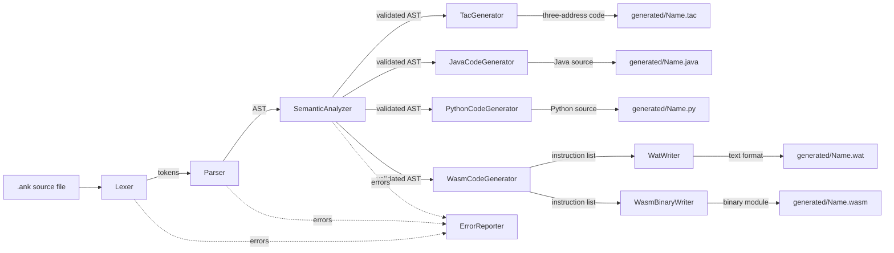
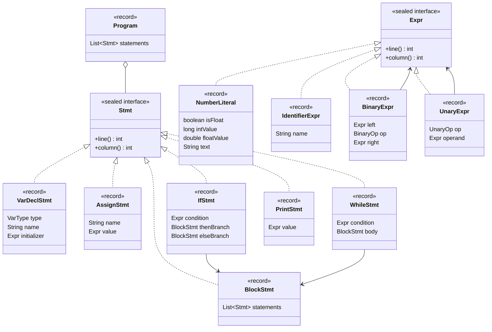
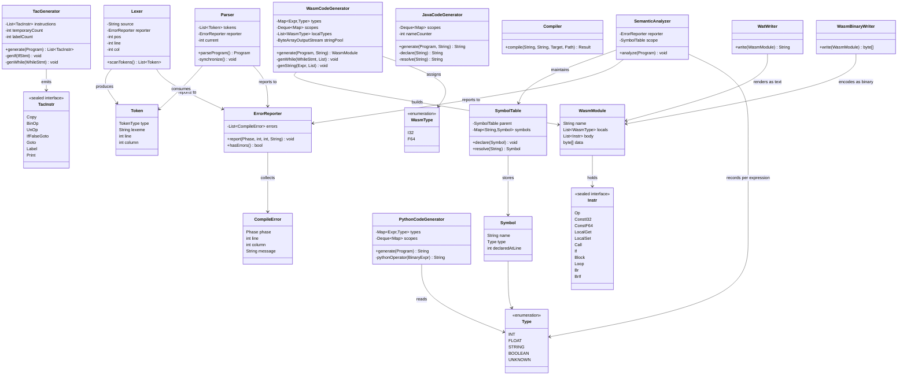

# CSE-4114 Final Report: অঙ্কুর (Ankur)

**Course:** CSE-4114 — Compiler Design and Construction Sessional
**Project:** A compiler for an originally-invented Bangla programming language
**Team:**

| # | Name | Student ID |
|---|---|---|
| 1 | MD Almas Ali | 0182320012101068 |
| 2 | Abidur Rahman Chowdhury | 0182320012101074 |
| 3 | Shajnin Rahman Omi | 0182320012101065 |
| 4 | Arman Hassan Rifat | 0182320012101075 |
| 5 | Md Shahriar Khan | 0182320012101051 |

This report covers the three required sections: the Pitch, the Compiler
Design, and the Language Grammar.

---

## 1. The Pitch

### Real-World Relevance

Bangla is the first language of roughly 170–230 million people, the vast
majority of them in Bangladesh. Programming education is increasingly
starting earlier — school-level coding curricula, coding clubs, and
self-taught learners working from phones and low-end laptops — but nearly
every language a beginner meets (Python, Java, C, JavaScript) uses English
keywords. For a student who isn't yet comfortable in English, that's a
**second barrier stacked on top of the first**: they have to learn an
unfamiliar vocabulary *and* an unfamiliar way of thinking, at the same time,
before they can write a single working program. Ankur exists to separate
those two problems, so the first thing a new programmer struggles with is
the actual *logic* — not what `while` means in a language they don't speak
yet.

### Problem-Solving: what gap Ankur fills

Existing options for a Bangla-speaking beginner sit at two extremes:

- **Block-based tools** (Scratch and similar) remove the language barrier
  entirely, but also remove real syntax — students never write an
  expression, never see a type, never hit a semicolon. It doesn't build the
  muscle memory that transfers to a real language later.
- **Mainstream text languages** teach real syntax, but reintroduce the
  English-vocabulary barrier this project is trying to remove.

Ankur sits in the middle: **real, typed, text-based syntax** — variables,
arithmetic with correct precedence, conditionals, loops — expressed
entirely in Bangla script, down to the identifiers a student names
themselves. Every design choice in the language reinforces this: one block
rule (`শুরু ... শেষ`) for the program, `if`, and `while` alike, instead of
mixing Bangla keywords with `{ }` braces; digits accepted in Bangla-Indic
*or* Arabic-numeral form, so numeral familiarity is never a blocker; and
compiler error messages that name the Bangla keyword directly (e.g. *"The
condition of 'যদি' must be a boolean expression"*), so debugging doesn't
require a mental translation step either.

### Long-Term Vision

As submitted for this course, Ankur is a toy front end plus a Java
transpiler. The long-term vision is a genuinely usable **first-language
teaching tool** for secondary schools: an editor with Bangla keyword
autocomplete, inline Bangla error messages (the compiler already produces
these), and a short bundled curriculum so the language isn't just a syntax
novelty but comes with a lesson plan. Crucially, Ankur is designed as a
**stepping stone, not a destination** — its type system, control flow, and
precedence rules map directly onto what a student sees next in Python or
Java, so graduating out of Ankur costs nothing. The goal isn't to keep
students in a Bangla-only ecosystem; it's to get them writing real,
correct, typed programs sooner, in a language that doesn't fight them on
day one.

### Future Roadmap (hypothetical, beyond this toy version)

- Boolean as a first-class declarable type (today it exists only
  transiently, as the result of a comparison)
- String operators: `বাক্য` values can be declared, assigned and printed
  today, but not concatenated or compared. Concatenation means building a
  new string at run time, which needs an allocator the WebAssembly target
  does not have, so it waits until that target grows a heap
- Text input, to go with the text output `বাক্য` already provides
- Functions (`ফাংশন`) for code reuse
- A small standard library of Bangla-named built-ins (math, I/O)
- A VS Code extension: Bangla keyword autocomplete, inline diagnostics
- An in-browser playground built on the WebAssembly backend described in
  §2 — a zero-install "try Ankur now" page for classrooms. The compiler
  already emits a module a browser can run directly, so what is left is the
  page around it, not the compiler work
- Companion lesson materials aimed at teachers, not just the language itself

---

## 2. Compiler Design

### Architecture overview

Ankur is a classical multi-pass compiler, hand-written in pure Java 21 with
**zero external dependencies** — no parser generator (e.g. ANTLR), no
codegen framework, and no test framework (tests run against the JDK's own
compiler API). That was a deliberate choice: the project requirements
expect any team member to be able to explain any part of the codebase in a
live review, which is far harder to guarantee for generated or
framework-mediated code.

1. **Lexical analysis** (`ankur.lexer.Lexer`) turns raw UTF-8 source text
   into a flat `List<Token>`. It recognizes Bangla-script keywords, mixed
   Bangla-script/ASCII identifiers, and numerals in either Bangla-Indic or
   Arabic form. An unrecognized character is reported and skipped rather
   than halting the whole scan.
2. **Syntax analysis** (`ankur.parser.Parser`) is a hand-written
   recursive-descent parser implementing a seven-level precedence-climbing
   expression grammar (see §3) and building an immutable AST out of Java 21
   `record`s. On a syntax error it performs panic-mode recovery —
   resynchronizing at the next `;` or a token that starts a new statement —
   so a single typo doesn't prevent every other error in the file from
   being reported in the same pass.
3. **Semantic analysis** (`ankur.semantic.SemanticAnalyzer`) is a single
   recursive walk over the AST performing scope resolution (a chained
   `SymbolTable` per block, so a nested block may shadow an outer
   declaration) and type checking (an `INT | FLOAT | STRING | BOOLEAN |
   UNKNOWN` lattice, where `UNKNOWN` is an error-recovery sentinel that
   suppresses cascading errors after an earlier one). It also records the
   resolved type of *every expression node*, which is as much its output as
   the error list is: two of the three code generators need those types,
   because neither WebAssembly nor Python can be handed an expression and
   asked what it meant, and re-deriving the rules in each backend would be
   three copies waiting to disagree.
4. **Intermediate representation** (`ankur.tac.TacGenerator`) lowers the
   validated AST to three-address code: every expression is flattened into
   one operation per instruction over named operands (`t1 = ৩ * ৪`,
   `t2 = ২ + t1`), and `যদি`/`যতক্ষণ` become explicit labels and jumps. The
   three code generators do not read this list — all three targets have
   structured control flow of their own, and rebuilding `if`/`while` from
   jumps would be work for nothing. It is here because it is the
   representation an optimiser or a real machine backend starts from, and
   because printing it makes the flattening visible while a program is
   still small enough to read by eye.
5. **Code generation** (`ankur.codegen.JavaCodeGenerator`) is a second walk,
   over an already-validated AST, that emits Java source text directly (it
   does not go through the TAC above — reasonable given the target is itself
   a structured high-level language with near 1:1 control-flow
   correspondence). It maintains **its own** lexical-scope tracking,
   independent of the semantic analyzer's, because it needs to solve a
   problem the semantic analyzer doesn't have: Ankur allows a nested block
   to shadow an outer variable name, but Java refuses to redeclare a name
   already in an enclosing scope. Only a declaration that actually does
   that — resolves to something still on the enclosing-scope stack — gets
   a counter-suffixed name; an ordinary, non-shadowing declaration (nearly
   every declaration in a real program) keeps the author's own Bangla
   identifier verbatim, so the generated Java reads like the source
   instead of a wall of synthetic names. This is the single most subtle
   correctness issue in the codebase, and it's covered directly by an
   automated test that compiles the generated Java with the JDK's own
   compiler API and asserts success — not just that the generator "looks
   right."
6. **Python code generation** (`ankur.codegen.PythonCodeGenerator`) targets
   the other language the course allows. Python is structurally the closest
   of the three — it has `if`/`else`, `while`, and arbitrary-precision
   integers — but it gets two things wrong for Ankur by default. Its `/` is
   always float division, so `পূর্ণ / পূর্ণ` has to be emitted as `//`; and
   it has *no block scope at all*, so a name assigned inside an `if` is the
   same variable as one outside it, and a genuinely shadowing declaration
   needs the same renaming the Java target uses — while an ordinary
   declaration keeps its bare name, same as there.
7. **WebAssembly code generation** (`ankur.codegen.WasmCodeGenerator`, the
   course's optional bonus target) is an alternative second walk over the
   same validated AST. Where the Java generator can lean on the target
   being another structured high-level language, WebAssembly is a typed
   stack machine, which forces three things the Java path never has to
   think about:
   - **Post-order emission.** Operands are pushed first and the operator
     instruction consumes them, so `ক + খ` becomes `local.get`,
     `local.get`, `i32.add`.
   - **No implicit conversion, at all.** Java widens `int` to `double`
     silently; WebAssembly does not, so the generator re-derives the type
     of every expression and inserts `f64.convert_i32_s` wherever Ankur's
     rules allow a পূর্ণ where a দশমিক is expected.
   - **Flat function-level locals.** Every local must be declared at the
     top of the function, so Ankur's block scoping is resolved entirely at
     compile time by giving each declaration its own local index — which is
     also, conveniently, what makes shadowing work here.

   Three smaller mismatches are worth naming because they are where a naive
   translation would silently produce a *wrong* program rather than an
   invalid one: WebAssembly has no `while` (it is built from a `block`
   wrapped around a `loop`), no f64 remainder instruction (দশমিক `%` is
   computed as `a - trunc(a / b) * b` through scratch locals), and no
   short-circuiting `and`/`or` (using `i32.and` would evaluate both sides,
   so `&&` and `||` are emitted as a structured `if` that yields an `i32`).

   The generator produces an instruction list rather than text, and two
   writers consume it: `WatWriter` renders the readable `.wat` text format,
   and `WasmBinaryWriter` encodes the same list as a real binary `.wasm`
   module (LEB128 integers, the section layout from the WebAssembly core
   specification, and all). Emitting the binary in-house rather than
   shelling out to `wat2wasm` keeps the project free of third-party tools
   and means the output runs on any WebAssembly host as-is. Since a module
   has no I/O of its own, `দেখাও` is an imported host function, and
   `NodeRunnerGenerator` emits the small JavaScript host that supplies it.

A shared `ankur.errors` package (`Phase`, `CompileError`, `ErrorReporter`)
lets every phase collect *all* of its errors in one pass instead of
stopping at the first, and lets `Main` decide, phase by phase, whether it's
safe to continue.

### Pipeline



`Compiler` (not pictured) orchestrates the phases in sequence and owns the
shared `ErrorReporter`, stopping the pipeline if any phase reports an
error; `Main` and the playground GUI both call it and differ only in where
they put the report it returns. The three code generators are alternatives
selected by `--target`, not stages of one another: each walks the same
validated AST independently, and `TacGenerator` runs whatever the target
is, being an intermediate step rather than something the user asked for.
Note that no generator has an edge into `ErrorReporter` — see the note
after the next diagram for why.

### AST class hierarchy

`Expr` and `Stmt` are `sealed` interfaces; every case below is a `record`.
Because the permitted-subtype list is closed, every `switch` over `Expr` or
`Stmt` elsewhere in the codebase (the AST printer, the semantic analyzer,
the code generator) is checked for exhaustiveness **by the compiler** —
adding a new statement kind (this is exactly how `WhileStmt` was added)
produces a compile error at every site that still needs updating, instead
of a silently-ignored case discovered later at runtime.



### Pipeline and support classes



Note that none of the three code generators depends on `ErrorReporter` —
by design. Each only ever runs on a `Program` that
`SemanticAnalyzer` already validated with zero errors, so it has nothing
left to report; an unresolved identifier reaching codegen is treated as an
internal invariant violation (`IllegalStateException`), not a normal
compile error.

`WatWriter` and `WasmBinaryWriter` both consume the same `WasmModule`
rather than one being derived from the other's output. That is deliberate:
the `.wat` a reader checks by eye and the `.wasm` a host actually executes
are then the same instructions by construction, and cannot drift apart.

---

## 3. Language Grammar

The complete grammar, in BNF, lives in [`grammar.bnf`](grammar.bnf) and is
reproduced here in full for the report.

```
<program>          ::= "শুরু" <statement-list> "শেষ"
<statement-list>    ::= { <statement> }
<statement>         ::= <var-decl> | <assignment> | <if-stmt> | <while-stmt> | <print-stmt>
<block>             ::= "শুরু" <statement-list> "শেষ"

<var-decl>          ::= <type> <identifier> [ "=" <expression> ] ";"
<type>              ::= "পূর্ণ" | "দশমিক" | "বাক্য"
<assignment>        ::= <identifier> "=" <expression> ";"
<if-stmt>           ::= "যদি" "(" <expression> ")" <block> [ "নাহলে" <block> ]
<while-stmt>        ::= "যতক্ষণ" "(" <expression> ")" <block>
<print-stmt>        ::= "দেখাও" "(" <expression> ")" ";"

<expression>        ::= <logical-or>
<logical-or>        ::= <logical-and> { "||" <logical-and> }
<logical-and>        ::= <equality> { "&&" <equality> }
<equality>           ::= <relational> { ( "==" | "!=" ) <relational> }
<relational>         ::= <additive> { ( "<" | ">" | "<=" | ">=" ) <additive> }
<additive>           ::= <multiplicative> { ( "+" | "-" ) <multiplicative> }
<multiplicative>     ::= <unary> { ( "*" | "/" | "%" ) <unary> }
<unary>              ::= ( "!" | "-" | "+" ) <unary> | <primary>
<primary>            ::= <int-literal> | <float-literal> | <string-literal>
                        | <identifier> | "(" <expression> ")"

<identifier>         ::= <id-start> { <id-part> }
<id-start>           ::= bangla-letter | ascii-letter
<id-part>            ::= <id-start> | <digit> | "_"
<int-literal>        ::= <digit> { <digit> }
<float-literal>      ::= <digit> { <digit> } "." <digit> { <digit> }
<string-literal>     ::= '"' { <string-char> } '"'
<digit>              ::= bangla-digit | ascii-digit
```

See `grammar.bnf` for the full lexical-grammar definitions (exact Unicode
ranges), the data-type and type-checking rules, the three-address code
lowering, and the Ankur→Java, Ankur→Python and Ankur→WebAssembly
code-generation mappings.
